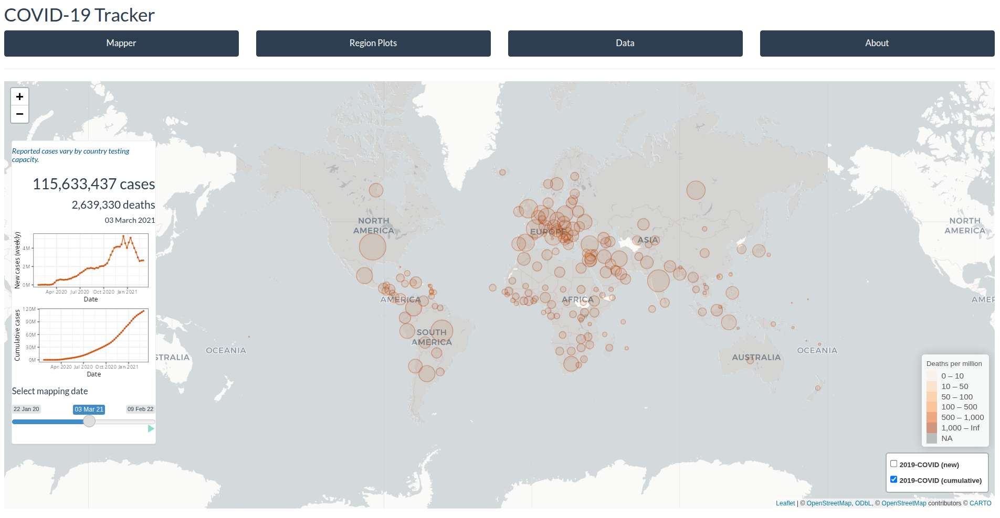

<!-- README.md is generated from README.Rmd. Please edit that file -->


```{r, include = FALSE}
  knitr::opts_chunk$set(
    collapse = TRUE,
    comment = "#>",
    fig.path = "man/figures/README-",
    out.width = "100%"
)
```

# `{COVID19Dash}`

<!-- badges: start -->
[](https://lifecycle.r-lib.org/articles/stages.html#experimental)
<!-- badges: end -->



## Installation

You can install the development version of `{COVID19Dash}` like so:

```{r, eval=FALSE}
devtools::install_github("bokola/COVID19Dash")
```

## Run

You can launch the application by running:

```{r, eval = FALSE}
COVID19Dash::run_app()
```

## About

You are reading the doc about version : `r golem::pkg_version()`

## About this app

This app was originally built by [Parker &
Leclerc](https://vac-lshtm.shinyapps.io/ncov_tracker/#) to visualize
COVID-19 cases and deaths. What’s presented here is a conversion of
parts of it to a modularized `{golem}` framework by [Basil
Okola](https://github.com/bokola).


## Tech used in this app

+ The [`{golem}`](https://github.com/ThinkR-open/golem) Framework was used to build the Shiny App backend.

+ The whole app is powered by [`{shiny}`](https://github.com/rstudio/shiny).

+ Data visualization is done with [`{ggplot2}`](https://github.com/tidyverse/ggplot2), 
[`{leaflet}`](https://github.com/rstudio/leaflet), and [`{plotly}`](https://github.com/plotly/plotly.R)

+ The UI was built with [`Boostrap`](https://getbootstrap.com/)

+ Docker images for both [shinyproxy](https://www.shinyproxy.io/) and [heroku](https://www.heroku.com/) were built
+ A docker container image was pushed to [dockerhub](https://hub.docker.com/)

Browse the full source code at https://github.com/bokola/covid19dash


This README has been compiled on the

```{r}
Sys.time()
```

Here are the tests results and package coverage:

```{r, error = TRUE}
devtools::check(quiet = TRUE)
```

```{r echo = FALSE}
unloadNamespace("COVID19Dash")
```

```{r, error = TRUE}
covr::package_coverage()
```
